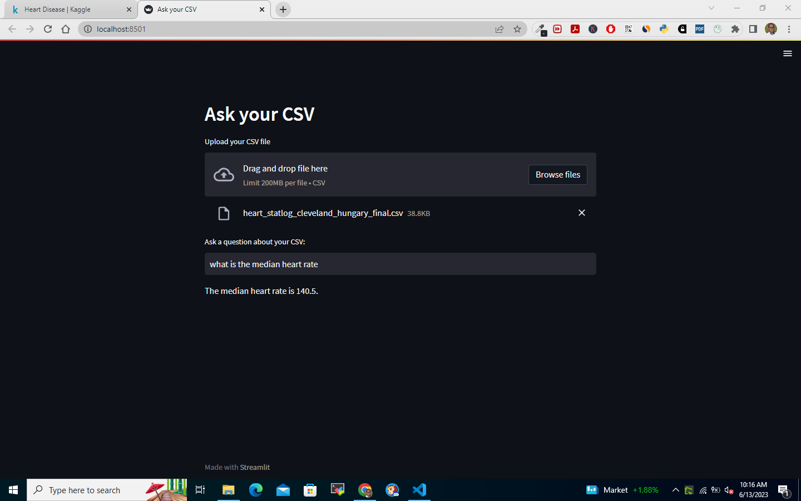
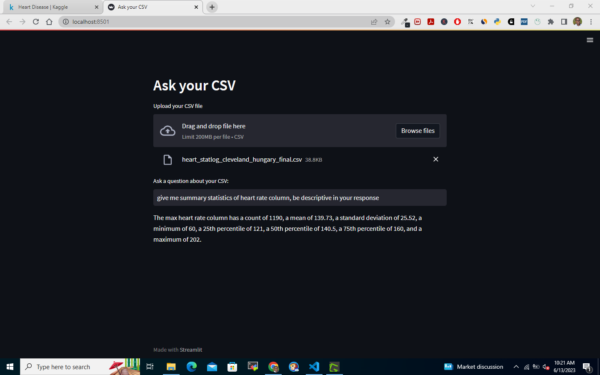

## Documentation :memo: :robot:

### Purpose :dart:
The purpose of this code is to create a Streamlit application that allows users to upload a CSV file and ask questions about its contents. The code uses the `langchain` library to create an agent that can understand and answer questions about the CSV data.

### Dependencies :wrench:
The code requires the following dependencies:

- `streamlit`: The Streamlit library for building interactive web applications. :globe_with_meridians:
- `langchain`: The LangChain library for natural language processing and understanding. :speech_balloon:
- `python-dotenv`: The Dotenv library for loading environment variables from a `.env` file. :closed_lock_with_key:
- `pandas`: The Pandas library for data manipulation and analysis. :bar_chart:

### `main` Function :computer:
The `main` function is the entry point of the program. It performs the following steps:

1. Loads the environment variables from the `.env` file using `load_dotenv()`. :gear:

2. Checks if the `OPENAI_API_KEY` environment variable is set. If it is not set or an empty string, the program prints an error message and exits. Otherwise, it prints a success message. :key:

3. Sets the Streamlit page configuration, including the page title and header. :page_with_curl:

4. Prompts the user to upload a CSV file using the Streamlit `file_uploader` function. The uploaded file is stored in the `csv_file` variable. :inbox_tray:

5. If a CSV file is uploaded (`csv_file` is not `None`), the code reads the file into a pandas DataFrame using `pd.read_csv()`. :file_folder:

6. Creates an agent using the pandas dataframe toolkit from the `langchain` library. The agent is initialized with an OpenAI instance and the DataFrame. The `verbose` flag is set to `True` for displaying detailed output. :robot:

7. Prompts the user to enter a question about the CSV data using the Streamlit `text_input` function. The question is stored in the `user_question` variable. :speech_balloon:

8. If a user question is provided (`user_question` is not `None` and not an empty string), the code runs the agent on the user's question using the `run` method. The result is displayed using the Streamlit `write` function within a `spinner` context. :arrows_counterclockwise:

### Running the Code :rocket:
To run the code:

1. Ensure that all the required dependencies are installed (including `streamlit`, `langchain`, `python-dotenv`, and `pandas`). :heavy_check_mark:

2. Set the `OPENAI_API_KEY` environment variable to your OpenAI API key. :key:

3. Save the code in a Python file, for example, `app.py`. :floppy_disk:

4. Open a command prompt or terminal and navigate to the directory containing the Python file. :file_folder:

5. Run the command `streamlit run app.py`. :arrow_forward:

6. The Streamlit application will start, and you can interact with it by uploading a CSV file and asking questions about it. The output will be displayed on the web interface. :computer:

Note: Make sure to replace `OPENAI_API_KEY` with your actual OpenAI API key before running the code.

    
    

    
   
   

